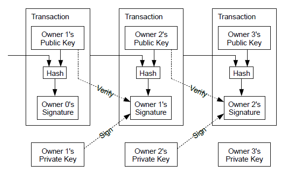

Bitcoin whitepaper 翻訳
===

# 概要

純粋にピア・トゥー・ピアで運用される電子通貨が存在すれば、金融機関を介さずに直接支払いを行うことが可能になる。電子署名の利用によって部分的にそれは実現するが、２重支払いの防止のために信頼された第三者機関の存在が必要な場合、主要なメリットは失われる。私達は二重支払いの防止に関して、ピア・トゥー・ピアなネットワークを利用した解決方法を提案する。そのネットワークはトランザクションをあるチェーンの中にハッシュ化して保存することで、トランザクションにタイムスタンプを付与する。そのチェーンはハッシュをベースにしたproof of workのチェーンで、proof of workをやり直さない限り変更することができない。最も長いチェーンは過去に起きたイベントを証明するだけでなく、最も多くのCPUパワーを使ってそのチェーンが生み出されたという事実も証明する。過半数のCPUパワーが攻撃者によって運用されない限り、誠実な参加者達は攻撃者よりも早いペースで最長のチェーンを更新し続ける。また、ネットワークそれ自体は最小限の構成しか必要としない。メッセージは最善努力のもと伝搬され、ノードは任意のタイミングでネットワークに対し離脱、参加できる。ネットワークに参加していない最中に起きたことへの証明として、ノードは参加時に最長のproof-of-work チェーンを受け取る。

# 1. イントロダクション

オンラインでのペイメントを実現するため、インターネット上の小売店はほとんど排他的とも言える金融機関に頼らざるを得ない。多くの取引に対してシステムは十分に稼働しているとはいえ、信頼ベースのシステムに固有の問題にまだ悩まされている。金融機関は利用者間の紛争解決を行う必要があるため、絶対に覆されることない取引というものは実現不可能である。紛争解決のためのコストは取引のコストを増加させるので、実用的な取引サイズの最小値は制限され、少額の手軽な取引も難しくなり、さらには"破棄されることのない取引は実現不可能"という事実が、覆すことができないサービスを提供している者たちにとって障害となっている。破棄の可能性があると、取引者間の信頼がさらに必要になる。***小売店は顧客が必要以上の情報を要求してくるという事態に備えなければならず***(???)、ある程度は詐欺が起こることも避けられないものとして受け入れる必要がある。これらのリスクや支払いの不確実性は、物理的な通貨を使うときは起こらない。しかし信頼されている第三者機関の仲介なしに、何かのコミュニケーションチャネル（インターネットなど）を通じて支払いを行うときには、避けられないものとなる。

必要なのは、信頼ではなく暗号学的証明に基づいた電子支払いシステムである。そのシステム上では、取引者同士が"信頼された第三者機関"を必要とすることなく直接取引を行うことが可能となる。計算上覆すことが非常に難しい取引は、小売店を詐欺から守るだろう。また、消費者を守るための機械的なエスクローのメカニズムも簡単に実現することができる。この論文では、ピア・トゥー・ピアで運用されるタイムスタンプサーバーを利用した、二重支払い問題への解決策を提案する。そのタイムスタンプサーバは取引の時間的な順序を計算的に（暗号学的に）証明する。そのシステムは誠実な参加者が多数派を占めている限り安全である。

# 2. トランザクション

ここで、電子署名のチェーンを電子コインとして定義する。それぞれのコインの所有者は、直前のトランザクションと次の所有者の公開鍵のハッシュに署名し、それをトランザクションの最後に付与することによってコインを送金する。受取人は署名を検証することで所有権のチェーンを確かめられる。

もちろん、二重支払いの問題はまだ解決していない。受取人は送金者が事前にそのコインを使用していないことを確認することが不可能である。よくある解決策は、信用された中央管理者、もしくは通貨発行者を導入することである。彼らは二重支払いを防止するため、すべてのトランザクションをチェックする。各トランザクションの後、新しいコインを発行するために使用されたコインは必ず通貨発行者の元へ返されなければならない。通貨発行者から直接発行された通貨のみが、二重支払いに使用されていないと信用することができる。この解決策の問題点は、その金融システムの全てが通貨発行者に依存するという点である。

前の所有者がコインを以前に使用していないという事実を受取人が確認できる方法が必要である。私達の目的において、一番最初の取引のみが正当な取引である。よってそれ以降の取引による二重支払いについては考慮しない。取引が行われていないことを確認する唯一の方法は、全ての取引を確認することである。通貨発行者ベースのモデルにおいても、通貨発行者は全ての取引について確認し、どれが最初に受領されたかを決定している。この方法を第三者機関の存在を抜きにして実現するために、取引は全体に公開されなければならない。また、取引の順序について参加者全員が１つの合意に達することができるようなシステムも必須である。受取人に必要なのは、各取引のタイミングにおいてその取引が最初に受領されたことに参加者の過半数が合意しているということへの証明である。

# 3. タイムスタンプサーバー

私達が提案する解決策はタイムスタンプサーバーからスタートする。タイムスタンプサーバーはアイテムを纏めたブロックのハッシュをとり、それを広く公開する。それはまさに新聞やUsenetのポストのように働く。タイムスタンプは、その当時データが確かに存在したということを証明する。ハッシュを計算するにはそのデータが必要なので、これは自明である。それぞれのタイムスタンプは直前のタイムスタンプをそのハッシュに含む。それはチェーンを形成し、新たなタイムスタンプが追加されるたびにそれ以前のタイムスタンプの存在が強化されていく。

# 4. Proof-of-Work

タイムスタンプサーバーをピア・トゥー・ピアで実現するために、新聞紙やUsenetのポストよりも、Adam BackのHashcashに似たproof-of-workシステムを使う必要がある。Proof-of-workは、それをハッシュ化したとき、その値がいくつかの0ビットで始まっている必要がある。それには要求される0ビットの数のべき乗の作業量が必要であるが、認証に必要なのは１回のハッシュ化のみである。

私達のタイムスタンプネットワークにおいては、ブロックのハッシュ値が要求される値を満たすまでブロック中に含まれるノンス値を増加させていくことでproof-of-workを実装することができる。一度CPUの仕事がproof-of-workを満足させるほど十分に費やされたならば、それをやり直さない限りブロックの変更は不可能となる。より後方にブロックがチェーンされていくと、あるブロックを変更するための仕事量はそれ以降の全てのブロックを変更するために必要な仕事量を含む。

Proof-of-workはまた、多数派の代表を決定するという問題をも解決する。仮にIPアドレスにつき１つの投票権を持つような仕組みによって多数派というのが規定されている場合、たくさんのIPを利用することができる人なら誰でも多数派を覆すことができる。Proof-of-workとは本質的に、CPUにつき1つの投票権を持つようなものである。多数派の選択は最長のチェーンという形で表現され、それは同時に最大の仕事による投票がなされたものでもある。CPUパワーの過半数が誠実な参加者によってコントロールされている限り、正当なチェーンは最も早く成長し、競合するチェーンを凌ぐ。過去のブロックを変更するためには、攻撃者はそのブロックとそれ以降の全てのブロックについて最新のブロックに追いつくまでproof-of-workをやり直す必要があるだろう。後のセクションで、後方にブロックが追加されるに従い、遅い攻撃者が追いつく可能性が指数関数的に減っていくことを示す。

ハードウェアの性能が上がり、ノードを過剰に走らせなくなった場合に備えるために、proof-of-workの難易度は１時間に生成されるブロックの数が一定になるように調整される。もし生成速度が早すぎれば、難易度は上昇する。

# 5. ネットワーク

ネットワークを運用するためのステップは以下のようである。

1. 新規トランザクションは全ノードにブロードキャストされる。
2. 各ノードは新規トランザクションをブロックに格納する。
3. 各ノードはそのブロックのproof-of-workを発見しようとする。
4. proof-of-workを発見したノードは、それを全体にブロードキャストする。
5. ノードはそのブロック内に含まれる全てのトランザクションが正当でかつ未だ使用されていないことを確認する。
6. ノードは次のブロックの生成を開始することで、そのブロックを受領したことを知らせる。つまり受領したブロックのハッシュを"前のブロックのハッシュ"とするブロックの生成を開始する。

ノードは常に、最長のチェーンが正しいと考え、それを伸ばすように働く。もし異なる２つのノードがそれぞれに異なるブロックを同時にブロードキャストした場合、あるノードは一方を先に受け取り、あるノードはもう一方を先に受け取るかもしれない。その場合、各ノードは最初に受け取ったブロックを正当なブロックとして扱い、そのブロックのチェーンを伸ばすように働く。ただし、もう一方のブランチがより長くなった場合に備えて他方のブロックも保存しておく。分岐点は次のproof-of-workが発見され、一方が他方より長くなった時点でなくなるだろう。最長でないブランチに貢献していたノードは直ちにより長いブランチに移動する。

新規トランザクションのブロードキャストは、全てのノードに届く必要はない。多数のノードに届いてさえすれば、そう長くないうちにそれらがブロックに取り込んでくれるだろう。ブロックのブロードキャストはまた、その欠落にも耐性がある。もしあるノードがブロックを受信しなかった場合、その次のブロックの受信時にそのブロックの欠落に気がつく。その後に欠落していたブロックを他のノードに対して要求すれば良い。

# 6. インセンティブ

慣例的に、ブロックの最初のトランザクションは特殊なトランザクションである。それはブロックの作成者に保有される新規コインを発行するものである。この仕組みはネットワークをサポートするノードに対して動機づけを行う。また、このネットワークにはいかなる中央管理者も存在しないため、この仕組みによって新しいコインが発行され流通していく。このような安定した一定量の新規コインの発行は、金の採掘者がリソースを消費して金を発掘し流通させる事象に似ている。今回のケースでは消費されるのは、CPUの時間と電力である。

手数料の収集もまた、ネットワークを運用することへの動機づけとなりうる。もしアウトプットの額がインプットの額よりも少なければその差分が取引手数料となり、ブロック作成者への報酬へ追加される。いずれ一定量のコインが流通した段階で、ブロック作成者へのインセンティブは完全に取引手数料のみへと移行し、インフレーションを抑制する。

このようなインセンティブはまた、ノードが誠実に振る舞うことを促進する。もし仮に強欲な攻撃者がより多くのCPUパワーを集められた場合、彼には２つの選択肢があることになる。つまりそのパワーを人々のコインを奪い取ることに使うか、新規コインを発行することに使うかである。その場合、誰よりもたくさんのコインを発行できるほうが、システムを傷つけると同時に自身の富を傷つけるよりも良いという結論に達するはずである。

# ディスクスペースの確保

使用済みのトランザクションであれば、それを使用したトランザクションが十分にブロックに取り込まれ変更される可能性がほとんどなくなったと言える状態に達しているという条件のもとで、ディスクスペース節約のためにデータを破棄することができる。ブロックハッシュの変更なくトランザクションデータの破棄を行うために、トランザクションはマークルツリーへとハッシュ化され、そのルートのみがブロックのハッシュに取り込まれる。古いブロックはそのマークルツリーのブランチを削ることにより、データサイズをコンパクトにすることができる。内部のハッシュを保存しておく必要はない。

トランザクションを除いたブロックヘッダーはおよそ80バイトほどになるだろう。仮に10分ごとにブロックが生成されるとすると、年間で4.2MBのデータ量となる。2008年現在、一般的にコンピュータ業界は2GBのRAMを売っていること、またムーアの法則によると現在の年間1.2GBの容量の増加は継続されるということから、ストレージのサイズは問題にならないはずである。仮にブロックヘッダーがメモリーに保存されなければならないとしても。

# 簡素化された支払い認証（SPV）

フルノードを走らせることなく支払いを認証することも可能である。そのためにはユーザーは最長のproof-of-workチェーンのブロックヘッダーさえ保持していれば良い。最長のチェーンはネットワークのノードに対して自身が納得できるまで要求することで手に入る。その後、トランザクションとそれを含んでいるであろうブロックとをリンクするマークルブランチを取得する。この手法ではトランザクションを自身でチェックすることはできないが、それをチェーン内のある場所とリンクすることにより、ネットワークがそのトランザクションを受理したということを確認できる。それ以降に追加されたブロックの存在によってそれはさらに確かなものになっていく。

このように、支払いの確認はネットワークが誠実なノードによってコントロールされている限り信頼できるものである。しかし攻撃者がより大きなパワーを持ったネットワークでは、それは不安定なものとなる。ネットワークノードは自身でトランザクションを認証することができるが、攻撃者がネットワークに対してより大きな力を持っている限り、簡素化された方法を利用しているノードは攻撃者の作ったトランザクションに騙される可能性がある。この事態に対処する一つの方法は、ネットワークノードが不正なブロックを検知した際に、矛盾の検知のためにSPVノードにも全ブロックと問題のトランザクションとのダウンロードを促すようなアラートを設定することである。とはいえやはり、頻繁にトランザクションを受け取るような企業の場合は、独立したセキュリティと素早い承認の実現のために自身でノードを走らせた方が良いだろう。

# 金額の結合と分割

コインをそれぞれ独立に扱うことは可能とはいえ、1セントごとに別々のトランザクションを作らなければならないのは少々扱いづらいだろう。そのため、金額を結合したり分割したりできるように、トランザクションは複数のインプットとアウトプットを持つ。通常、前回の大きな取引を参照する1つのインプットか、少額を組み合わせた複数のインプット、そして高々2つのアウトプットを持つ。すなわち、支払い用アウトプットと、必要に応じて送金者に送り返すようなお釣り用アウトプットである。

あるトランザクションがいくつかのトランザクションに依存し、さらにそれらのトランザクションがより多くのトランザクションに依存していたとしても、それは問題にはならないということに言及しておく。取引履歴の独立完全なコピーを抽出する必要は全くないのだ。

# プライバシー

今までのバンクモデルは、関係者への情報のアクセスを制限することでプライバシーを実現してきた。しかし、取引をネットワーク全体に公表する必要がある以上、このような方法によるプライバシーの実現は不可能である。しかし、情報の流れを別の場所で断つことによって、つまり公開鍵を匿名にすることで実現できる。ネットワークの参加者は誰でも、”誰かが別の誰かに送金をしている”ということは分かるが、それが実際に誰なのかは分からない。これは株式市場に似ている。各取引の時間と量は公開されているが、それが誰と誰の間で行われたものかという情報は公開されていない。

さらなる防御策として、各取引が同じ所有者に紐付けられるのを防ぐために、取引ごとに新しいキーペアを使用すべきである。しかしそのような取引の紐付けもある程度は避けられない。なぜなら複数インプットを持つトランザクションは、それらのインプットが共通の所有者のものであることを示すからである。ここに存在するリスクは、もしあるキーの所有者が判明したとき、取引の紐付けによって他の取引の所有者も同じであることが分かってしまうことである。

# 計算

攻撃者が誠実な参加者より早く悪意のあるチェーンを生成しようとしているケースを考える。もし仮にそれに成功したとしても、システムが攻撃者によって任意に変更されるようになるということではない。例えば、どこからともなくコインを生成したり、攻撃者とは一切関わりのないコインを奪ったりすることはできない。各ノードは不正な取引を支払いとして受け入れないし、誠実なノードがそのような取引の入ったブロックを受け入れることもない。攻撃者ができる唯一のことは、最近の支払いの内容を変更することくらいである。

攻撃者と誠実な参加者との間のレースは、Binomial Random Wlakとみなすことができる。成功イベントは、誠実な参加者のチェーンが１ブロック伸び、リードを１つ分広げることである。そして失敗イベントは、攻撃者のチェーンが１ブロック伸び、ギャップが１詰まることである。

攻撃者が与えられたギャップ分を埋めて正規のチェーンに追いつく可能性は、ギャンブラーの破産問題と類似している。つまり、無限のクレジットを持つギャンブラーが、ある赤字額からスタートし、収支が五分になるまで何回でもある賭けを繰り返す場合を考えると、私達はギャンブラーが収益五分に達する可能性を計算することができる。同様に、攻撃者が正規のチェーンに追いつく可能性を計算することができる。その方法を次に示す。

**TODO**

# まとめ

私達は信頼に依らない電子取引のシステムを提案した。まず簡単なコインのフレームワークを示した。そのコインは電子署名によって構成され、電子署名は強力な所有権の管理を可能にする。しかし、二重支払い防止の方法がなければそのコインは依然不完全である。これを解決するために、proof-of-workによって取引履歴を保存するピア・トゥー・ピアのネットワークを提案した。その仕組みは、誠実な参加者が消費されるCPUパワーの過半数を占めている限り、攻撃者による変更を計算上不可能にする。ネットワークは構造化されておらずシンプルであるので、強固なものになる。参加者全員は少量の共同作のもとで同時に働く。メッセージは特定の場所に送られる必要はなく、最善努力のもと配送されれば良いので、参加者はそれぞれ区別される必要がない。参加者はネットワークをいつでも離脱することができ、離脱中に起きた取引への証明としてproof-of-workチェーンを再参加時に受け取る。参加者はブロックが正当か不正なものかについて、CPUパワーによる投票を行う。つまり正当なブロックの受領を表すためにそれに続けてチェーンを伸ばし、不当なブロックの拒否を表すためにそれを無視してチェーンを伸ばす。あらゆるルールとインセンティブは合意形成メカニズムによって強制される。
